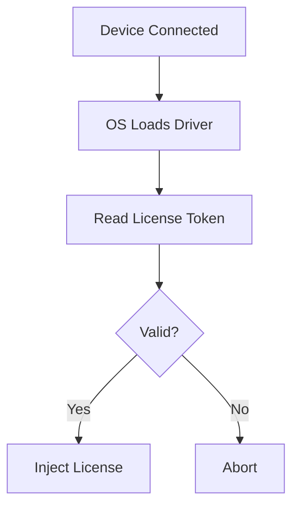
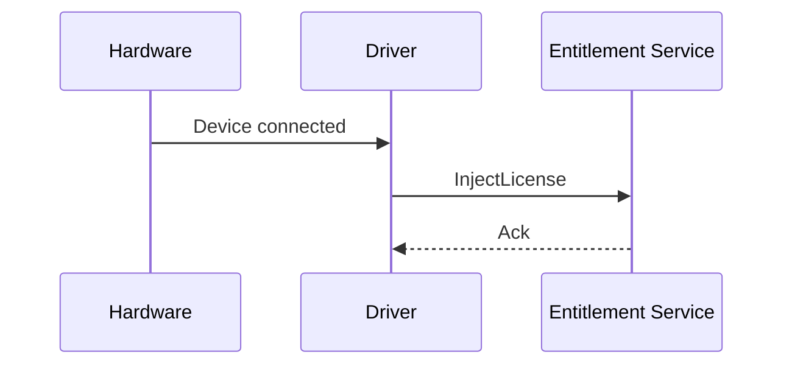
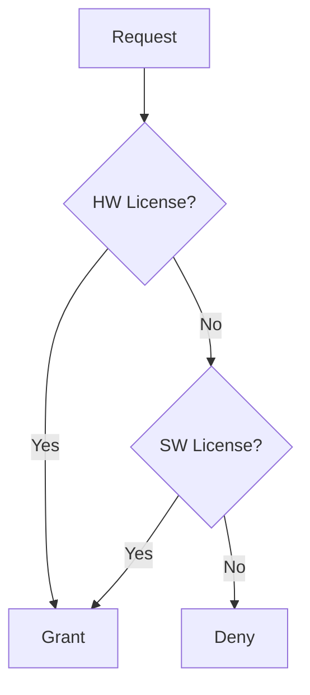

# Invention Disclosure

## Disclosure 1 – Hardware Injection

### Diagrams

**Flowchart – License Injection Process**

**Sequence Diagram – Driver Interaction**

## Disclosure 2 – Multi-Source Architecture

### Diagrams

**Flowchart – License Evaluation**

