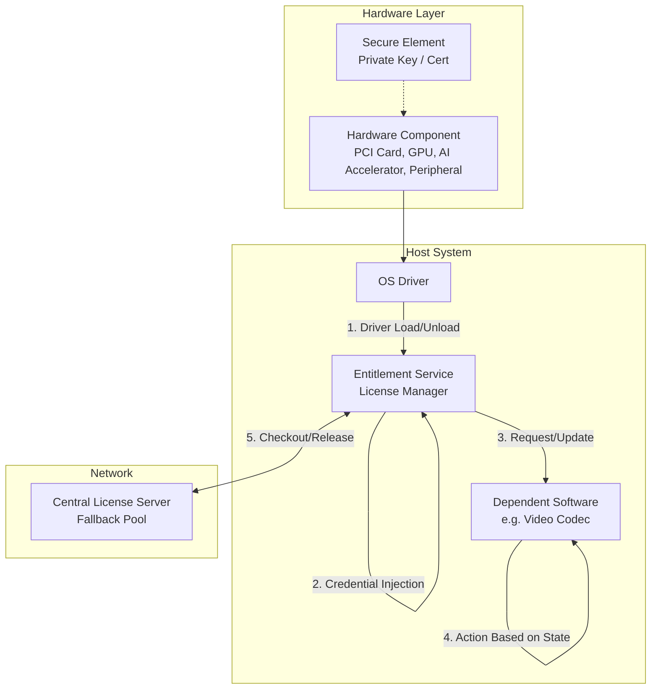
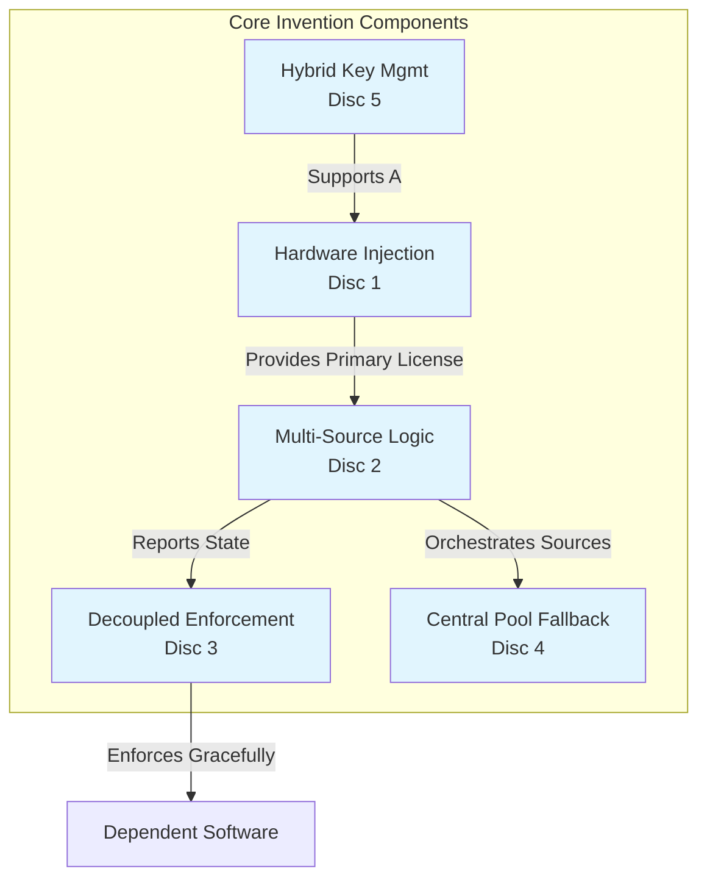
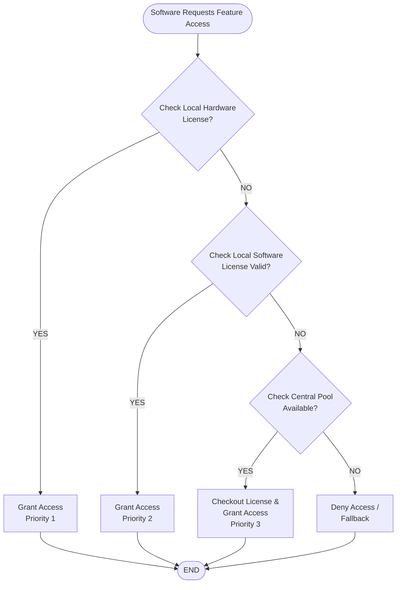
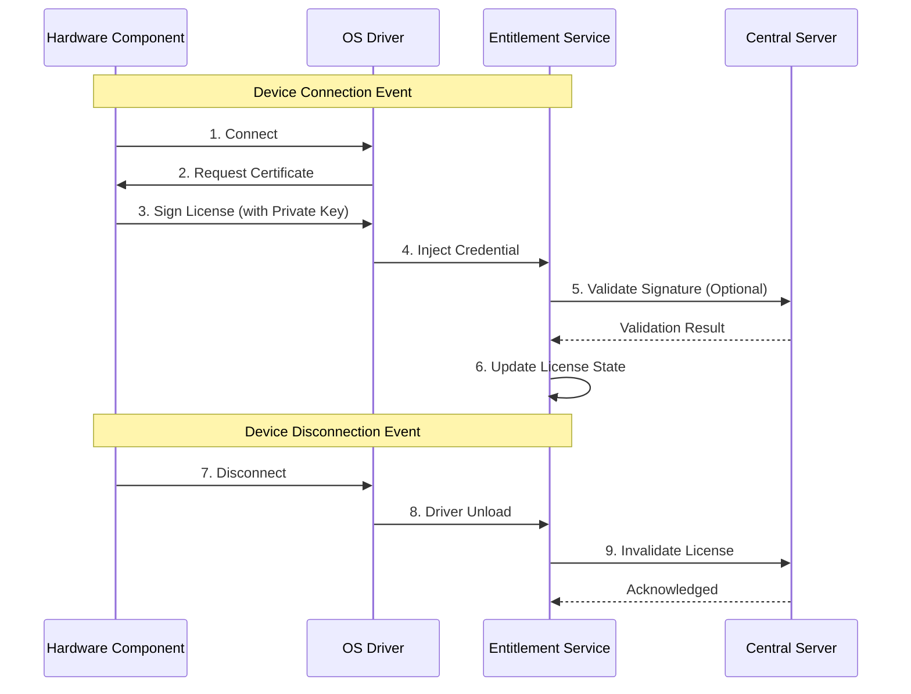

# Invention Disclosure Document (IDD)

**Title of Invention:**  
Dynamic Entitlement Management System Based on Hardware Presence and Multi-Source Licensing

**Inventors:**  
[Your Name/Team Names]

**Date:**  
[Current Date]

**Technical Field:**  
Computer Software Licensing, Digital Rights Management (DRM), Hardware Authentication, System Architecture.

---

## 1. Background and Problem Statement

**Current State:**  
Existing licensing systems are typically static. Software licenses are often tied to a specific machine ID (hard to move) or a physical dongle (easy to lose/forget). Centralized license servers require constant connectivity and often enforce hard locks (software stops working immediately if the license is lost).

**Problem:**  
There is a lack of flexibility in current systems to:
1.  Utilize hardware component presence (internal or external) as a dynamic license source.
2.  Seamlessly switch between local (hardware/software) and centralized license sources.
3.  Allow dependent applications to handle license loss gracefully rather than hard-failing.
4.  Support both unique and shared cryptographic key models for hardware authentication.
5.  Manage a centralized pool of licenses for fallback when local entitlements are exhausted.

---

## 2. Summary of the Invention

The invention is a system and method for managing software entitlements (licenses) that dynamically aggregates multiple sources. It validates access based on the presence of connected **hardware components** (e.g., internal cards, external peripherals), local software licenses, or a centralized license pool. Crucially, the system separates the **validation** of the license from the **enforcement** of the consequences, allowing the software component (e.g., a codec) to decide how to react if a license is lost.

---

## 3. Detailed Description of the Invention

### 3.1 System Architecture

The system comprises three main layers:
1.  **Hardware Components:** Any hardware module that can be enumerated by the OS. This includes external peripherals (monitors, mice) and internal components (PCIe cards, video cards, AI accelerators, storage controllers). These components contain cryptographic credentials (certificates).
2.  **Entitlement Service:** A central software service running on the host system. It manages the state of all entitlements.
3.  **Dependent Software:** Applications (e.g., video codec, AI inference engine) that request access to features based on the Entitlement Service's state.

---

### 3.2 The Five Core Invention Disclosures

This overall system is composed of five distinct but interconnected inventive concepts. Below is the detailed breakdown for each.

#### Disclosure 1: Hardware-Driven Entitlement Injection Mechanism

*   **Problem:** Traditional hardware licensing (dongles) requires a specific driver or dedicated port. Standard software licensing does not account for the dynamic presence of generic hardware components (like internal AI accelerators or video cards). There is no mechanism to automatically inject a license from a hardware component into the OS licensing layer upon connection.
*   **Detailed Description:** This mechanism leverages the OS driver model. When a hardware component is connected (or powered on), the OS loads the device driver. The entitlement service (or a driver extension) intercepts this event, communicates with the component's secure element, retrieves a cryptographic credential (certificate + payload), and injects it into the central entitlement service. Upon component removal or power-down (driver unload), the credential is automatically invalidated.
*   **Implementation Methods:**
    *   **Event Listener:** A system service listens for OS device enumeration events (Plug and Play, PCIe bus scan).
    *   **Secure Channel:** A secure communication channel (e.g., I2C, SMBus, PCIe sideband, or vendor-specific API) is established between the driver and the component's secure element to read the certificate.
    *   **Injection API:** The driver calls a local API of the Entitlement Service to register the credential.
    *   **Cleanup Routine:** A callback is registered with the OS to trigger license invalidation when the driver is unloaded.
*   **Novelty:** Using the generic OS driver load/unload event as the trigger for dynamic license state changes, applicable to both internal and external hardware components.

#### Disclosure 2: Multi-Source Entitlement Service Architecture

*   **Problem:** Licensing systems are often siloed. A hardware license doesn't talk to a software license, and neither talks to a central server. If one source fails, the user is locked out, with no graceful fallback.
*   **Detailed Description:** The Entitlement Service maintains a unified state database that aggregates licenses from three distinct sources: Local Hardware (Priority 1), Local Software (Priority 2), and Central Server (Priority 3). The service evaluates these sources in order of priority. If a higher priority license is valid, it grants access. If not, it automatically checks the next source.
*   **Implementation Methods:**
    *   **State Machine:** A central state machine tracks the validity of each source type.
    *   **Priority Queue:** A logical queue defines the check order (Hardware > Software > Central).
    *   **Timeout Handling:** Logic to handle timeouts when checking the Central Server to prevent hanging the application.
    *   **Unified API:** A single API endpoint for applications to request access, regardless of which source granted it.
*   **Novelty:** The specific logic of prioritizing local hardware presence over software keys and central servers, and the seamless failover mechanism between these heterogeneous sources.

#### Disclosure 3: Decoupled Enforcement Model

*   **Problem:** Standard DRM systems enforce restrictions directly (hard lock). If a license expires or a component is removed, the application crashes or stops immediately. This causes poor user experience and data loss.
*   **Detailed Description:** The Entitlement Service acts solely as a **Validation Authority**. It determines if a license is valid or revoked. It does **not** enforce the consequence. Instead, it notifies the dependent software (e.g., the codec) of the state change. The dependent software implements its own logic to handle the loss of entitlement (e.g., watermarking output, reducing resolution, or saving state).
*   **Implementation Methods:**
    *   **Event Bus:** A publish/subscribe system where the Service publishes "License Revoked" events.
    *   **Callback Interface:** Applications register a callback function to handle state changes.
    *   **Grace Period Logic:** The Service can optionally provide a grace period timer, allowing the App to finish a current task before fully disabling.
*   **Novelty:** The architectural separation of the **validation** layer from the **enforcement** layer, allowing the application to implement business-specific consequences for license loss rather than a system-wide hard lock.

#### Disclosure 4: Dynamic License Pooling with Central Fallback

*   **Problem:** Local licenses (hardware/software) can be exhausted or expire. Users are left without access even if they are authorized, because there is no backup source.
*   **Detailed Description:** The Entitlement Service can connect to a Central License Server to "checkout" a temporary license from a pool when local sources are unavailable. This checkout is for a defined duration (session or fixed time) and is released back to the pool when no longer needed.
*   **Implementation Methods:**
    *   **Checkout API:** A network call to the Central Server requesting a license token.
    *   **Lease Management:** A local timer tracks the checkout duration.
    *   **Renewal Logic:** A background thread attempts to renew the checkout before expiry if connectivity exists.
    *   **Release on Disconnect:** The checkout is automatically released if the primary hardware device is removed.
*   **Novelty:** Integrating a floating license pool specifically as a fallback mechanism for a hardware-authentication system, rather than using it as the primary source.

#### Disclosure 5: Hybrid Key Management System

*   **Problem:** Unique cryptographic keys per device offer high security but increase manufacturing costs. Shared keys reduce cost but lower security. Current systems usually support only one or the other.
*   **Detailed Description:** The Entitlement Service is designed to validate credentials from hardware regardless of the keying model. It can validate a certificate signed by a unique device key OR a certificate signed by a shared batch key. The service checks the certificate chain and, for shared keys, verifies the device ID against a revocation list.
*   **Implementation Methods:**
    *   **Certificate Validation:** Standard PKI validation (checking signature, expiry, revocation).
    *   **Key Type Detection:** Logic to detect if the certificate contains a unique ID or a Batch ID.
    *   **Revocation Lists:** Maintenance of two types of lists: Unique Device IDs (for shared keys) and Certificate Revocation Lists (CRL).
*   **Novelty:** A single service architecture capable of validating both unique-device keys and shared-batch keys within the same workflow, providing manufacturing flexibility without compromising the licensing logic.

---

### 3.3 How the Disclosures Combine

These five disclosures work together to create a robust, flexible licensing ecosystem:

1.  **Foundation (Disclosure 1 & 5):** The **Hardware Injection Mechanism** (1) provides the primary source of entitlement, made versatile by the **Hybrid Key Management** (5).
2.  **Orchestration (Disclosure 2):** The **Multi-Source Architecture** (2) acts as the brain, prioritizing the hardware license (1) but falling back to local software or the **Central Pool** (4).
3.  **Flexibility (Disclosure 3):** The **Decoupled Enforcement** (3) ensures that even if the hardware is removed or the central pool is empty, the system can degrade gracefully rather than failing catastrophically.

---

## 4. Specific Embodiments

*   **Internal Compute Accelerators:** AI accelerators, DSPs, or FPGAs with secure elements that unlock software AI inference capabilities.
*   **Graphics Processing Units:** Video cards with unique keys that unlock high-performance rendering features.
*   **Storage Controllers:** PCI cards that unlock specific data throughput or encryption features.
*   **External Peripherals:** Monitors, docking stations, or USB security keys that act as license tokens.
*   **Key Management:** The system is agnostic to whether the hardware uses a unique key or a shared batch key.

---

## 5. Novelty and Advantages (Why is this patentable?)

1.  **Dynamic Hardware Binding:** Tying software features to the *real-time presence* of any hardware component (internal or external) via driver injection.
2.  **Hybrid Source Management:** The specific logic of prioritizing local hardware, then local software, then central pool.
3.  **Decoupled Consequence Handling:** Separating the license validation authority from the application's reaction to license loss.
4.  **Flexible Key Agnosticism:** A single system architecture that validates both unique and shared cryptographic keys from hardware.
5.  **Resource Pooling:** The integration of a central fallback pool specifically designed to supplement hardware-based licensing.

---

## 6. Alternative Implementations and Scope Expansions

To maximize the breadth of the patent claims, the following variations and expansions should be considered:

### 6.1 Hardware Scope Expansion
*   **Form Factors:** The invention applies to any hardware form factor, including:
    *   **Internal:** PCIe cards, M.2 modules, SoC integrated circuits, On-die secure enclaves (TPM, SGX, TrustZone).
    *   **External:** USB devices, Thunderbolt docks, DisplayPort/HDMI displays, Network Attached Storage (NAS), Mobile devices (phones/tablets acting as dongles).
*   **Connection Types:** The mechanism works regardless of the bus protocol (PCIe, USB, I2C, SMBus, Ethernet, Wi-Fi, Bluetooth).
*   **Virtualization:** The hardware component can be a **Virtual Device** (vGPU, vNIC) in a virtualized environment (VMware, Hyper-V, KVM), where the "physical" presence is emulated by a hypervisor.

### 6.2 Software Scope Expansion
*   **Dependent Applications:** The licensed software is not limited to codecs. It includes:
    *   **AI/ML Models:** Unlocking specific neural network layers or inference speeds.
    *   **OS Features:** Unlocking advanced networking, security, or management features.
    *   **Enterprise Software:** ERP, CRM, or CAD tools requiring specific hardware acceleration.
    *   **Gaming:** Unlocking specific graphics settings or character classes based on hardware.
    *   **Containerized Apps:** Docker/Kubernetes pods that require specific hardware nodes to run.

### 6.3 License Logic Expansion
*   **License Types:**
    *   **Time-Based:** Expiry dates, recurring subscriptions.
    *   **Usage-Based:** Count-based (e.g., 1000 renders), quota-based (e.g., 100GB storage).
    *   **Concurrency-Based:** Floating licenses across a network of devices.
    *   **Feature-Based:** Granular unlocking of specific functions (e.g., 4K vs. 1080p).
*   **Checkout Logic:**
    *   **Automatic:** The service automatically checks out a license when local sources fail.
    *   **Manual:** The user must explicitly request a fallback license.
    *   **Hybrid:** System attempts auto-checkout, but requires user confirmation for long-term loans.

### 6.4 Security Model Expansion
*   **Key Management:**
    *   **Zero-Knowledge Proofs:** The hardware proves it has the key without revealing the key itself.
    *   **Remote Attestation:** The service verifies the hardware's integrity state before granting a license.
    *   **Key Rotation:** The hardware can request new keys periodically to prevent long-term compromise.
    *   **Hierarchical Keys:** A root key signs intermediate keys, which sign device keys (PKI hierarchy).
*   **Storage:**
    *   **Hardware Security Module (HSM):** Keys stored in dedicated HSMs.
    *   **Trusted Platform Module (TPM):** Keys stored in on-board TPMs.
    *   **Encrypted Flash:** Keys stored in encrypted non-volatile memory.

### 6.5 Deployment and Network Expansion
*   **Topology:**
    *   **Cloud-Native:** The Entitlement Service runs in Kubernetes, scaling with demand.
    *   **Edge Computing:** The Service runs on local edge nodes for low-latency validation.
    *   **Peer-to-Peer:** Devices can share licenses with each other (mesh network) without central server involvement.
*   **Connectivity:**
    *   **Offline Mode:** The service caches central licenses for extended offline periods.
    *   **Air-Gapped:** The service runs on isolated networks where the central server is on a different physical network.

### 6.6 Enforcement Model Expansion
*   **Consequences:**
    *   **Hard Lock:** Feature completely disabled.
    *   **Soft Lock:** Feature disabled with watermarking or reduced performance.
    *   **Telemetry:** Feature continues, but usage is logged and reported to the vendor.
    *   **Graceful Degradation:** Quality is reduced (e.g., lower resolution, slower speed) rather than stopping.
    *   **Notification:** User is warned but allowed to proceed (e.g., "License Expired, please renew").

---

## 7. Diagrams

### License Validation & Fallback Flowchart

### Hardware Credential Injection Sequence

