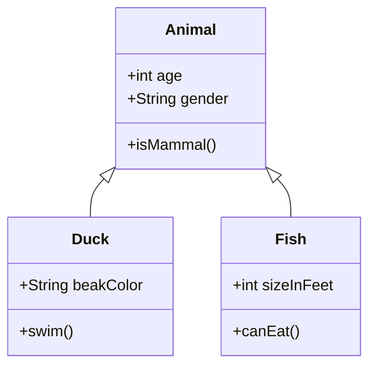
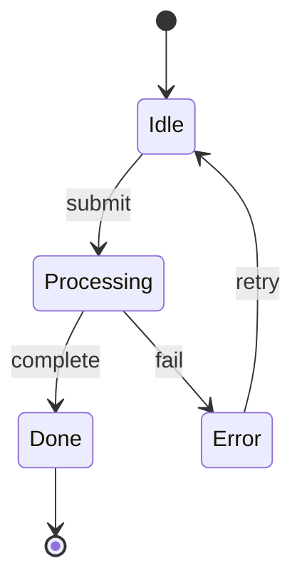

# Mixed Diagram Types

## Class Hierarchy



## State Machine



## Data Model

```er
    CUSTOMER ||--o{ ORDER : places
    ORDER ||--|{ LINE-ITEM : contains
    CUSTOMER {
        string name
        string email
    }
    ORDER {
        int id
        date created
    }
```

Some trailing text after the diagrams.
