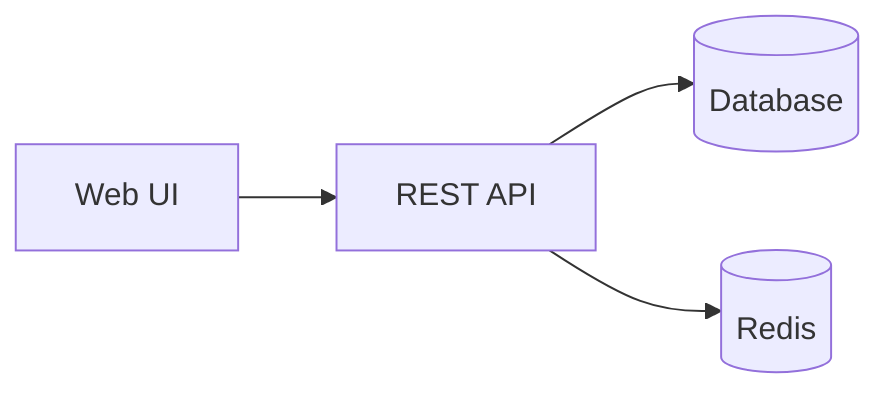
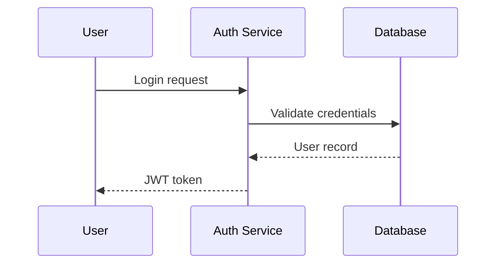
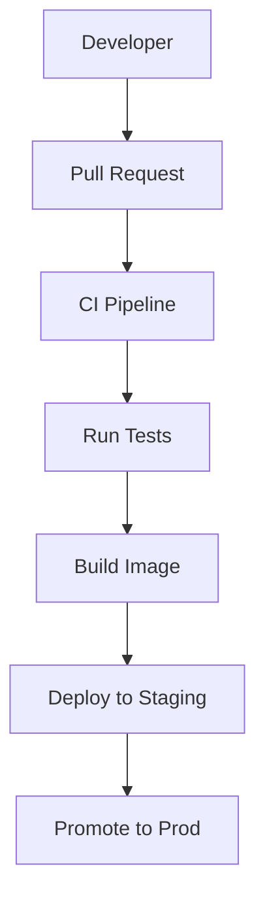

# Project Architecture

An overview of the system with multiple diagrams.

## 1.1 System Components

```mermaid
graph LR
    UI[Web UI] --> API[REST API]
    API --> DB[(Database)]
    API --> Cache[(Redis)]
```

## 1.2 User Authentication Flow

```mermaid
sequenceDiagram
    participant U as User
    participant A as Auth Service
    participant D as Database
    U->>A: Login request
    A->>D: Validate credentials
    D-->>A: User record
    A-->>U: JWT token
```

## 1.3 Deployment Pipeline

```mermaid
graph TD
    Dev[Developer] --> PR[Pull Request]
    PR --> CI[CI Pipeline]
    CI --> Test[Run Tests]
    Test --> Build[Build Image]
    Build --> Deploy[Deploy to Staging]
    Deploy --> Prod[Promote to Prod]
```
