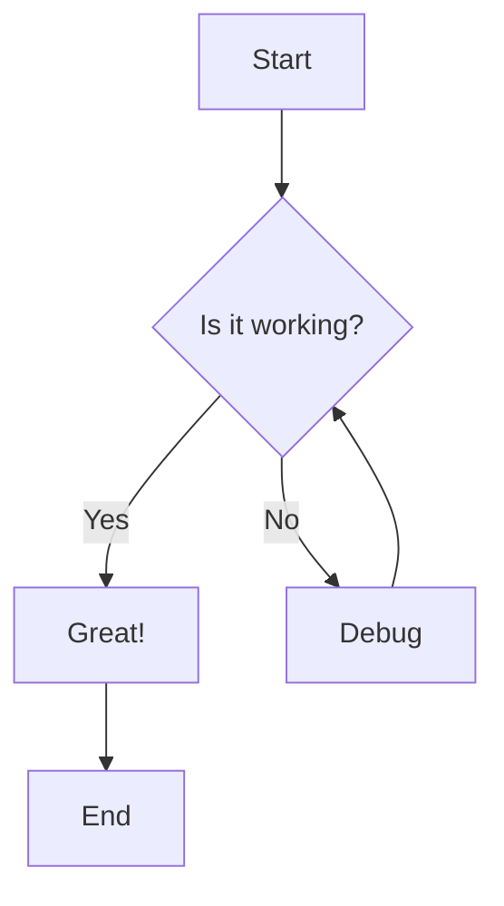

# Simple Flowchart Example

This document contains a single Mermaid flowchart diagram.

## Process Overview

```mermaid
graph TD
    A[Start] --> B{Is it working?}
    B -->|Yes| C[Great!]
    B -->|No| D[Debug]
    D --> B
    C --> E[End]
```

That concludes the process overview.
